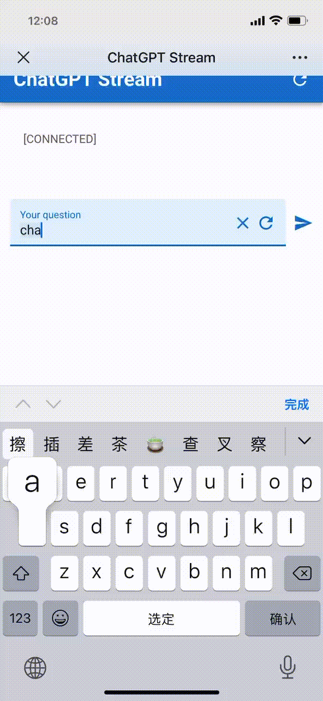

# 实时ChatGPT服务

## chatGPT-service和chatGPT-stream

- chatGPT-service: [https://github.com/cookeem/chatgpt-service](https://github.com/cookeem/chatgpt-service) 
  - chatGPT-service是一个后端服务，用于实时接收chatGPT的消息，并通过websocket的方式实时反馈给chatGPT-stream
- chatGPT-stream: [https://github.com/cookeem/chatgpt-stream](https://github.com/cookeem/chatgpt-stream) 
  - chatGPT-stream是一个前端服务，以websocket的方式实时接收chatGPT-service返回的消息

## 效果图




## 快速开始

```bash
# 拉取代码
git clone https://github.com/chatgpt-service.git
cd chatgpt-service

# chatGPT的注册页面: https://beta.openai.com/signup
# chatGPT的注册教程: https://www.cnblogs.com/damugua/p/16969508.html
# chatGPT的APIkey管理界面: https://beta.openai.com/account/api-keys

# 修改config.yaml配置文件，修改appKey，改为你的openai.com的appKey
vi config.yaml
# openai的appKey，改为你的apiKey
appKey: "xxxxxx"


# 使用docker启动服务
docker-compose up -d

# 访问页面
# http://localhost:3000
```

## 如何编译

```bash
# 拉取构建依赖
go mod tidy
# 项目编译
go build

# 执行程序
./chatgpt-service

# 相关接口
# ws://localhost:9000/api/ws/chat

# 安装wscat
npm install -g wscat

# 使用wscat测试websocket，然后输入你要查询的问题
wscat --connect ws://localhost:9000/api/ws/chat

```